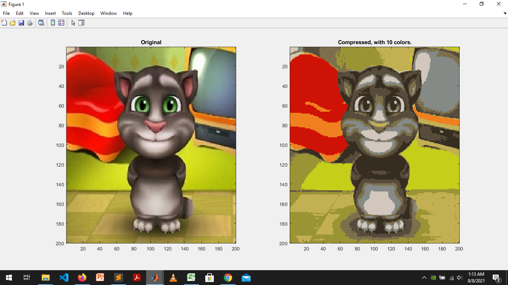
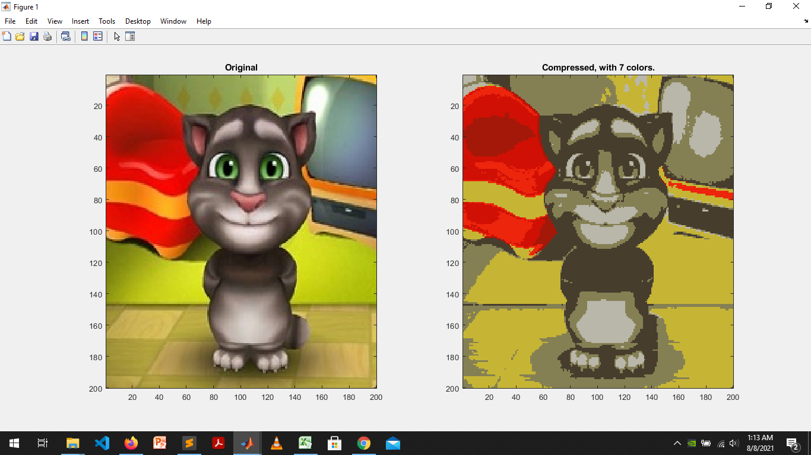
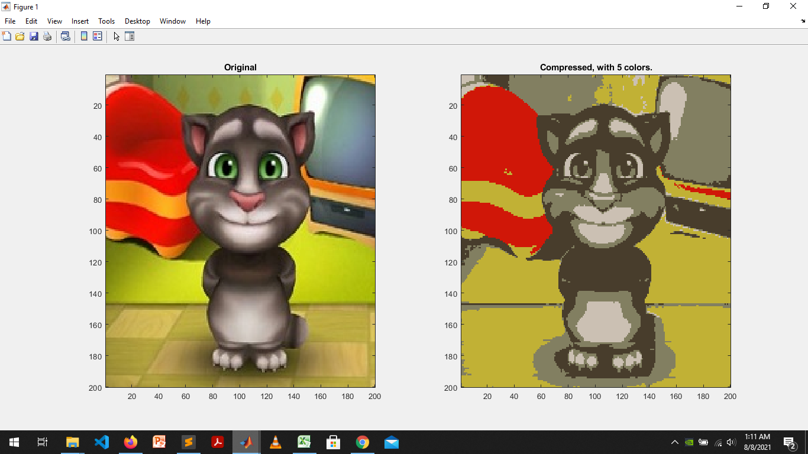

# Color-Compressor

This is a module of Matlab codes to compress images using K-means clustering  , If the input image contains n different colors, the output image can be represented using only k << n colors, achieving high level of compression, by grouping regions with similar colors in a single cluster.

We can change the value of k(no. of colours) according to our need 

For example:- 

This is a image compressed with 5 colours. 

The same image compressed with 7 colors.

now it is compressed with 10 colours. 

